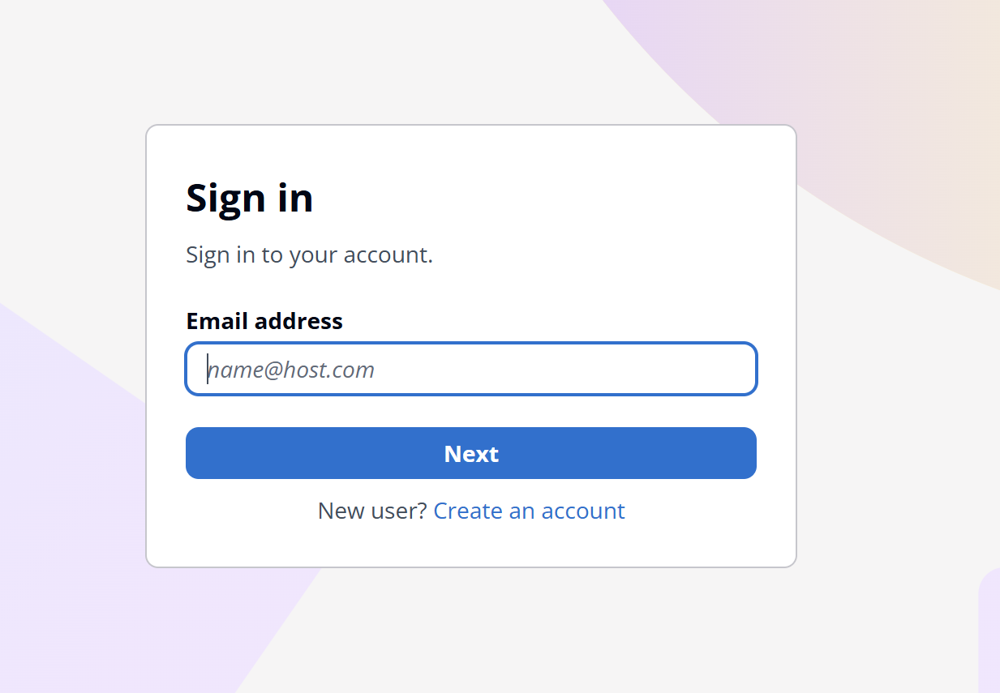
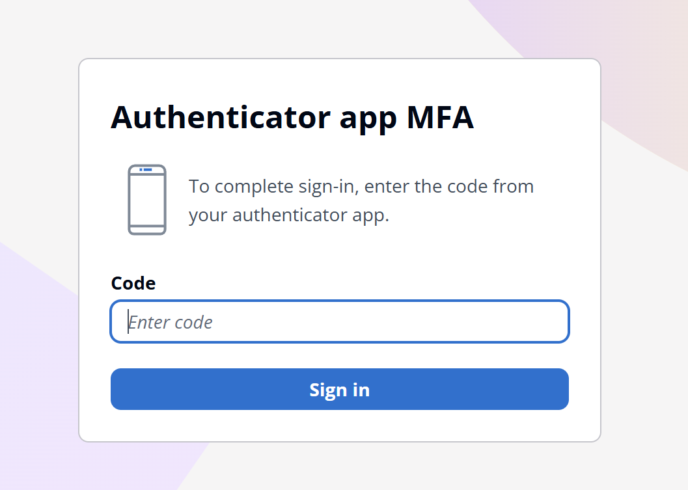
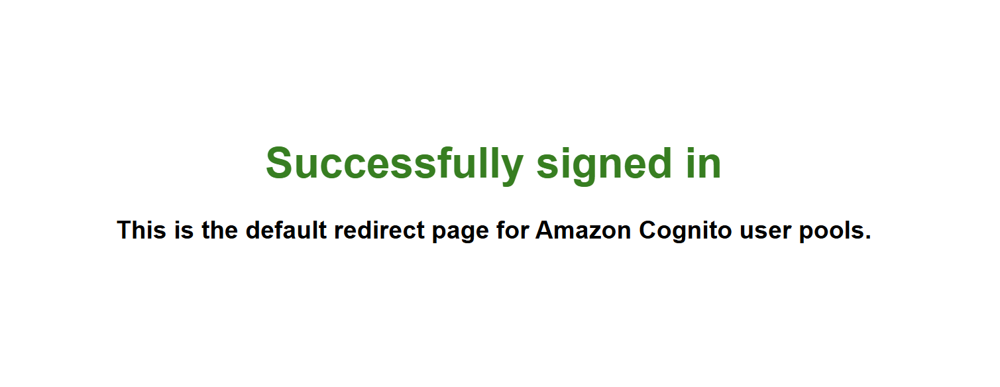
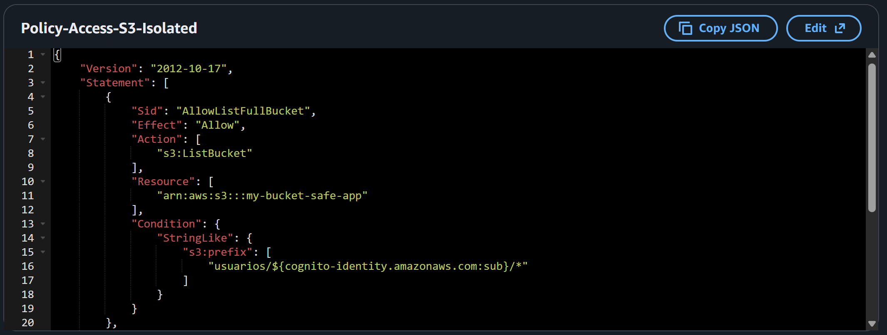

# 🛡️ Secure Serverless Authentication System with AWS Cognito

## 🚀 Project Overview
This project demonstrates the implementation of an enterprise-grade Identity and Access Management (IAM) system. It leverages **Amazon Cognito** to manage user lifecycles and **AWS IAM** to enforce the **Principle of Least Privilege**, ensuring users can only interact with authorized backend resources.

## 🧠 Architecture & Logic
The architecture follows a decoupled authentication and authorization flow:
1. **Authentication:** Users sign in via the **Cognito Hosted UI** (an AWS-managed login page).
2. **Security Layer:** Mandatory **Multi-Factor Authentication (MFA)** via Software Token (TOTP) is required for all users.
3. **Authorization:** Once authenticated, the **Cognito Identity Pool** exchanges the login token for temporary **AWS IAM Credentials**.
4. **Least Privilege:** Users assume a specific IAM Role with fine-grained permissions (e.g., read-only access to a specific S3 bucket).

## 🛠️ Tech Stack
* **Amazon Cognito:** User Pools (Identity) & Identity Pools (Access).
* **AWS IAM:** Roles, Inline Policies, and Trust Relationships.
* **Infrastructure as Code (IaC):** Terraform

### 1. Cognito Hosted UI (Default Login Page)

*The fully functional login interface provided by AWS.*

### 2. Multi-Factor Authentication (MFA)

*Enforcement of a second security layer using an Authenticator App.*

### 3. Fine-Grained IAM Policy

*The JSON policy restricting the user to only specific cloud resources.*
**Key Technical Detail:**
By using the `${cognito-identity.amazonaws.com:sub}` variable within the IAM policy, the system ensures **Identity Isolation**. This means that even though thousands of users might share the same IAM Role, each individual is cryptographically restricted to their own "private folder" within the S3 bucket. A user can only read or write data where the folder name matches their unique Cognito Identity ID, preventing any unauthorized cross-user data access.

## 💡 Key Learnings
* **AuthN vs AuthZ:** Deep dive into the difference between Authentication (User Pools) and Authorization (Identity Pools).
* **Cost Optimization:** Implemented MFA using Software Tokens to stay within the AWS Free Tier (avoiding SMS costs).
* **Cloud Security Best Practices:** Applied granular IAM policies to prevent lateral movement within the cloud environment.

---
*Developed by CesarJ262 - Cloud Computing*
